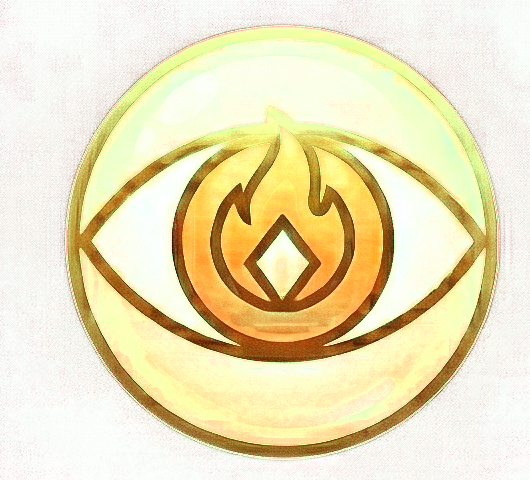

# Orracle — Brand

**Tagline:** Local LLM / Image Gen

The image at `branding/logo.png` is the **definitive logo** for orracle. It was
cropped from the authoritative icon sheet at
`~/projects/personal_icon_pack.png`. Do not substitute, recolor, or redraw.

## Glyph

A gold eye with a stylized flame for a pupil, set inside a pale circular
halo. Two meanings stack cleanly: *oracle* (the all-seeing eye) and *fire*
(the spark of generation). The outer halo is translucent cream — a lens,
not a frame.

## Color palette

| Role       | Hex        | Name            | Use                                     |
|------------|------------|-----------------|-----------------------------------------|
| Primary    | `#F8E898`  | Oracle Gold     | Brand gold, headings, generate button   |
| Highlight  | `#F8F898`  | Candle Glow     | Focus ring, hover on gold elements      |
| Flame Mid  | `#884808`  | Oracle Bronze   | Flame outline, active generation state  |
| Flame Deep | `#783808`  | Burnt Wick      | Borders, muted text on light            |
| Surface    | `#F8F8A8`  | Vision Cream    | Cards, modal bodies (light-mode tone)   |

## Usage

- The flame inside the pupil is always **Oracle Bronze** on **Oracle Gold** —
  never invert, never use pure red/orange flame colors.
- While a generation is in progress, animate the flame between
  **Oracle Bronze** and **Burnt Wick** (slow 2s ease) as the "working" state.
- Do not crop or simplify the glyph into just the eye — the eye *and* the
  flame together are the mark.
- Font pairing: use a humanist serif for "Orracle" wordmarks when the logo
  is displayed large (hero panels); monospace is fine for inline/toolbar use.
